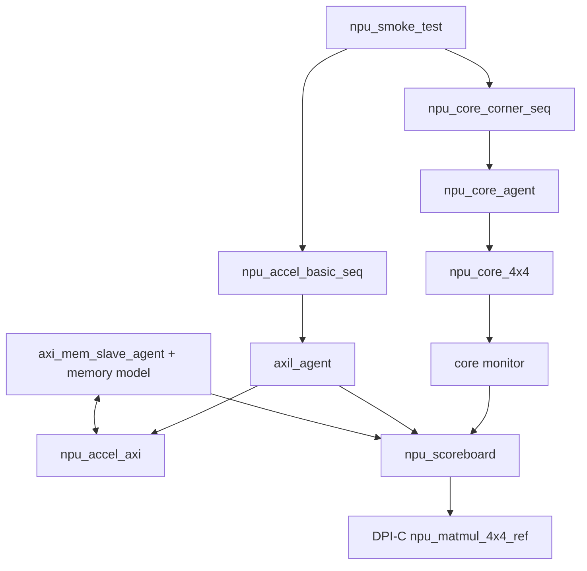

# UVM 验证平台搭建计划

## 1. 架构决策

本项目采用 Hybrid 策略：算法验证借鉴 `FPGA-ACC-MAC` 的 4x4 脉动阵列 golden 数据思路，张量激励借鉴 `SAURIA` 的稀疏/极值/拓扑切换生成方式，AXI 数据面使用轻量 AXI memory slave agent 封装，后续可替换为 `tvip-axi` 或团队已有 AXI VIP。

当前 RTL 的 `npu_core_4x4` 是寄存器直连矩阵输入，`npu_accel_axi` 是 AXI-Lite 控制面加 AXI4 master DMA 数据面。为了避免过度工程化，模块级验证拆成两层：

- Core direct UVM：直接驱动 `start/a_matrix/b_matrix/pe_mask/dfs_divider`，用 DPI-C 参考模型比较 `c_matrix`。
- Accelerator UVM：AXI-Lite agent 配置寄存器，AXI memory slave agent 提供 A/B 矩阵并接收 C burst，scoreboard 用同一个 DPI-C 模型比较 DMA 写回数据。



## 2. DPI-C Golden Model

Golden model 位于 `uvm_tb/c_model/npu_golden_model.cpp`。核心接口是：

```systemverilog
import "DPI-C" context function void npu_matmul_4x4_ref(
    input  byte signed a[],
    input  byte signed b[],
    input  shortint unsigned pe_mask,
    output int c[]
);
```

C++ 侧只在函数调用期间读取 SV open array，立即复制到本地 `int8_t[16]`，计算 `int32_t[16]` 后写回输出数组；不保存 SV 指针、不返回堆内存，规避 DPI-C 生命周期错误。

## 3. 已生成目录

```text
uvm_tb/
  agent/   Core direct agent, AXI-Lite master agent, AXI memory slave agent
  c_model/ DPI-C golden model and C++ self-test
  env/     Scoreboard, env, smoke test
  seq/     Core corner sequence and accelerator register/DMA sequence
  sim/     Filelist and run.ps1
  tb/      Interfaces and top-level UVM testbench
```

## 4. 覆盖目标

- `npu_core_4x4`：signed INT8、零矩阵、极值矩阵、single PE、diagonal mask、checkerboard mask、DFS 0..3。
- `npu_accel_axi`：AXI-Lite 配置、A/B read burst、C write burst、随机反压、`done/clear_done`、idle power-gate 状态。
- AXI 协议检查：INCR burst beat 数、`WLAST/RLAST`、4KB boundary 违规探测。

## 5. 执行方式

本机当前没有 Questa/VCS，因此先跑 smoke：

```powershell
powershell -ExecutionPolicy Bypass -File uvm_tb/sim/run.ps1 -Mode smoke
```

有 Questa 后：

```powershell
powershell -ExecutionPolicy Bypass -File uvm_tb/sim/run.ps1 -Mode questa -Test npu_smoke_test
```

有 VCS 后：

```powershell
powershell -ExecutionPolicy Bypass -File uvm_tb/sim/run.ps1 -Mode vcs -Test npu_smoke_test
```

## 6. 当前限制

Icarus Verilog 不支持完整 UVM，因此本机 smoke 只验证 C++ golden model，并调用现有 Icarus RTL 回归测试核心路径。完整 UVM 编译和 DPI 动态库链接需要 Questa/VCS 环境进一步收敛。
